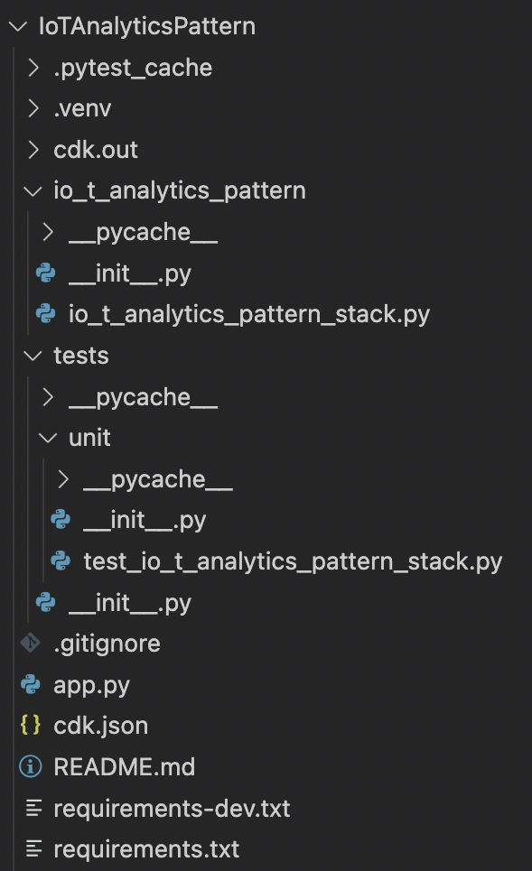

# Getting started with IoT Analytics template guide 

## Setting up and prerequisites
___

### AWS Account 

If you don't already have an AWS account follow the [Setup Your Environment](https://aws.amazon.com/getting-started/guides/setup-environment/) getting started guide for a quick overview.

___

### AWS CloudFormation 

Before you start using AWS CloudFormation, you might need to know what IAM permissions you need, how to start logging AWS CloudFormation API calls, or what endpoints to use. Refer to this [guide](https://docs.aws.amazon.com/AWSCloudFormation/latest/UserGuide/settingup.html) to get started using AWS CloudFormation.

___

### AWS  CDK

**Note**: If you are just going to use the sample demo template you can skip this section.

The AWS Cloud Development Kit (CDK) is an open-source software development framework that lets you define your cloud infrastructure as code in one of its supported programming languages. It is intended for moderately to highly experienced AWS users. Refer to this [guide](https://aws.amazon.com/getting-started/guides/setup-cdk/?pg=gs&sec=gtkaws) to get started with AWS CDK.

___

## Template deployment and CloudFormation stack creation

A template is a JSON or YAML text file that contains the configuration information about the AWS resources you want to create in the [stack](https://docs.aws.amazon.com/cdk/v2/guide/stacks.html). To learn more about how to work with CloudFormation templates refer to the [Working with templates](https://docs.aws.amazon.com/AWSCloudFormation/latest/UserGuide/template-guide.html) guide. 

You can either use the provided demo template and deploy it directly to the console or customize the template’s resources before deployment using AWS CDK. Based on your decision follow the respective section below. 

___

### Sample demo template 

By using the sample JSON template that is provided, you do not need to take any further actions except creating the stack by uploading the template file. For simplicity’s sake, a simple code is provided that you can run on your device. It is an example of multiple devices sending their weather measurements to the cloud through ExpressLink. You can find the code and guide to get it working under the `demo/demo_weather_station_code` directory.

Follow the steps below to create the CloudFormation stack using the sample template file. 

1. Sign in to the AWS Management Console and open the [AWS CloudFormation console.](https://console.aws.amazon.com/cloudformation)
2. If this is a new CloudFormation account, choose **Create New Stack**. Otherwise, select **Create Stack** and then select **with new resources**.
3. In the **Template** section, select **Upload a template file** and upload the JSON template file. Choose **Next**.
4. In the **Specify Details** section, enter a stack name in the **Name** field.
5. If you want you can add tags to your stack. Otherwise, choose **Next**.
6. Review the stack’s settings and then select **Create.**
7. At this point, you will find the status of your stack to be `CREATE_IN_PROGRESS`. Your stack might take several minutes to get created. See the next sections to learn about monitoring your stack creation.

___

### Custom template

If you are interested in using the CloudFormation templates more than just for demo purposes, you need to customize the stack’s resources based on your specific use case. Follow the steps below to do so:

1. Make sure that you already [set up your AWS CDK](https://aws.amazon.com/getting-started/guides/setup-cdk/?pg=gs&sec=gtkaws) environment.
2. Starting in your current directory, change your directory and go to `aws_cdk/IoTAnalyticsPattern` directory.
3. Just to verify everything is working correctly, list the stacks in your app by running `cdk ls`. If you don't see `IoTAnalyticsPatternStack`, make sure you are currently in `IoTAnalyticsPattern` directory.
4. The structure of the files inside `IoTAnalyticsPattern` is as below: 

* `io_t_analytics_pattern_stack.py`  is the main code of the stack. It is here where the required resources are created. 
* `tests/unit/test_io_t_analytics_pattern_stack.py` is where the unit tests of the stack are written. The unit tests check
    * Right creation of the resources in addition to their properties
    * Dependencies between the resources 
    * Right error handlings in case of input violations
* `cdk.json` tells the CDK Toolkit how to execute your app. Context values are key-value pairs that can be associated with an app, stack, or construct. You can add the context key-values to this file or in the command line before synthesizing the template.
* `README.md` is where you can find detailed instructions on how to get started with the code including how to synthesize the template, a set of useful commands, the stack’s context parameters, and details about the code.
* `cdk.out` is where the synthesized template (in a JSON format) will be located in.

1. Run `source .venv/bin/activate` to activate the app's Python virtual environment.
2. Run `python -m pip install -r requirements.txt` and `python -m pip install -r requirements.txt` to install the dependencies.
3. Go through the `README.md` file to learn about the context parameters that need to be set by you prior to deployment.
4. Set the context parameter values either by changing `cdk.json` file or by using the command line.
    1. To create a command line context variable, use the **`—-context (-c) option`**, as shown in the following example: `$ cdk cdk synth -c bucket_name=mybucket`
    2. To specify the same context variable and value in the `cdk.json` file, use the following code.`
          {"context": { "bucket_name": "mybucket"}`
5. Run `cdk synth` to emit the synthesized CloudFormation template.
6. Run `python -m pytest` to run the unit tests. It is the best practice to run the tests before deploying your template to the cloud.
7. Run `cdk deploy` to deploy the stack to your default AWS account/region.
8. Use the instructions in the ***Stack management*** section below to manage your stack creation. 

## Stack management

___

### Viewing CloudFormation stack data and resources

After deployment, you may need to monitor your created stack and its resources. To do this, your starting point should be AWS CloudFormation.  

1. Sign in to the AWS Management Console and open the [AWS CloudFormation console](https://console.aws.amazon.com/cloudformation).
2. Select the **Stacks** tab to view all the available stacks in your account. 
3. Find the stack that you just created and select it. 
4. To verify that the stack’s creation was done successfully, check if its status is `CREATE_COMPLETE`. To learn more about what each status means refer to [stack status codes](https://docs.aws.amazon.com/AWSCloudFormation/latest/UserGuide/cfn-console-view-stack-data-resources.html#cfn-console-view-stack-data-resources-status-codes). 
5. You can view the stack’s general information such as its ID, status, policy, rollback configuration, etc under the **Stack info** tab.  
6. If you click on the **Events** tab, each major step in the creation of the stack sorted by the time of each event, with the latest events on top is displayed. 
7. You can also find the resources that are part of the stack under the **Resources** tab. 

There is more information on viewing your CloudFormation stack information [here](https://docs.aws.amazon.com/AWSCloudFormation/latest/UserGuide/cfn-console-view-stack-data-resources.html#cfn-console-view-stack-data-resources-view-info).

___

###  Monitoring the generated resources

If the stack is deployed successfully, the following resources must get created under your stack. You can verify their creation by checking the **Resources** tab in your stack.

|Resourse	|Type	|
|---	|---	|
|CDKMetadata	|[AWS::CDK::Metadata](https://docs.aws.amazon.com/cdk/api/v1/docs/constructs.ConstructMetadata.html)	|
|IoT Analytics Channel	|[AWS::IoTAnalytics::Channel](https://docs.aws.amazon.com/AWSCloudFormation/latest/UserGuide/aws-resource-iotanalytics-channel.html)	|
|IoT Analytics Datastore	|[AWS::IoTAnalytics::Datastore](https://docs.aws.amazon.com/AWSCloudFormation/latest/UserGuide/aws-resource-iotanalytics-datastore.html)	|
|IoT Analytics Dataset	|[AWS::IoTAnalytics::Dataset](https://docs.aws.amazon.com/AWSCloudFormation/latest/UserGuide/aws-resource-iotanalytics-dataset.html)	|
|IoT Analytics Pipeline	|[AWS::IoTAnalytics::Pipeline](https://docs.aws.amazon.com/AWSCloudFormation/latest/UserGuide/aws-resource-iotanalytics-pipeline.html)	|
|IAM role and policy that grants IoT access to IoT Analytics	|[AWS::IAM::Role](https://docs.aws.amazon.com/AWSCloudFormation/latest/UserGuide/aws-resource-iam-role.html) [AWS::IAM::Policy](https://docs.aws.amazon.com/AWSCloudFormation/latest/UserGuide/aws-resource-iam-policy.html)	|
|IoT Rule	|[AWS::IoT::TopicRule](https://docs.aws.amazon.com/AWSCloudFormation/latest/UserGuide/aws-resource-iot-topicrule.html)	|
|CloudWatch log group to capture error logs	|[AWS::Logs::LogGroup](https://docs.aws.amazon.com/AWSCloudFormation/latest/UserGuide/aws-resource-logs-loggroup.html)	|
|IAM role and policy that grants IoT access to CloudWatch	|[AWS::IAM::Role](https://docs.aws.amazon.com/AWSCloudFormation/latest/UserGuide/aws-resource-iam-role.html) [AWS::IAM::Policy](https://docs.aws.amazon.com/AWSCloudFormation/latest/UserGuide/aws-resource-iam-policy.html)	|

___

### Handling stack failures

If CloudFormation fails to create, update, or delete your stack, you will be able to go through the logs or error messages to learn about the issue. There are some general methods for troubleshooting a CloudFormation issue. For example, you can follow the steps below to find the issue manually in the console. 

* Check the status of your stack in the [CloudFormation console](https://console.aws.amazon.com/cloudformation/). 
* From the **Events** tab, you can see a set of events while the last operation was being done on your stack.
* Find the failure event from the set of events and then check the status reason of that event. The status reason usually gives a good understanding of the issue that caused the failure.

In case of failures in stack creations or updates, CloudFormation automatically performs a rollback. However, you can also [add rollback triggers during stack creation or updating](https://docs.aws.amazon.com/AWSCloudFormation/latest/UserGuide/using-cfn-rollback-triggers.html#using-cfn-rollback-triggers-create) to further monitor the state of your application. By setting up the rollback triggers if the application breaches the threshold of the alarms you've specified, it will roll back to that operation. 

Finally, this [troubleshooting guide](https://docs.aws.amazon.com/AWSCloudFormation/latest/UserGuide/troubleshooting.html#basic-ts-guide) is a helpful resource to refer to if there is an issue in your stack. 

___

### Estimating the cost of the stack

There is no additional charge for AWS CloudFormation. You pay for AWS resources created using CloudFormation as if you created them by hand. Refer to this [guide](https://docs.aws.amazon.com/AWSCloudFormation/latest/UserGuide/using-cfn-paying.html) to learn more about the stack cost estimation functionality.

## Ingesting and visualizing your IoT data with the constructed resources

___

### Sending data to the cloud from your device

Now that your stack and all the required resources are created and available, you can get started by connecting your device to the cloud and sending your data to IoT Core. 

* If you are new to AWS IoT Core, this [guide](https://docs.aws.amazon.com/iot/latest/developerguide/connect-to-iot.html) is a great starting point to connect your device to the cloud. 
* After connecting your device to IoT Core, you can use the [MQTT test client](https://docs.aws.amazon.com/iot/latest/developerguide/view-mqtt-messages.html) to monitor the MQTT messages being passed in your AWS account. 
* Move to the **Rules** tab under the **Message Routing** section in the [AWS IoT console](https://console.aws.amazon.com/iot/home). There you can verify the creation of the newly created topic rule and its [iotanalytics rule action](https://docs.aws.amazon.com/iot/latest/developerguide/iotanalytics-rule-action.html) which sends data received from your device to the IoT Analytics channel.

___

### Query data in the IoT Analytics console

In the previous section, you verified that your device is connected to the cloud and is sending data to IoT Core. To query the data, you should use your IoTAnalytics dataset. A dataset contains the SQL that you use to query the data store along with an optional schedule that repeats the query at a day and time you choose. To get started follow these steps:

* Open the [AWS IoT Analytics Console](https://console.aws.amazon.com/iotanalytics).
* From the navigation pane, choose **Datasets.**
* Find the dataset that was created by your stack and select it.
* Select **Run now**.
* Select the **Content** tab.
* The result of the query is your dataset content, stored as a file, in CSV format. You also have the option to download the CSV file. 
* If you cannot see any data in the dataset content, follow these steps:
    * First, make sure that your device is connected to the cloud and is sending data by using the [MQTT test client](https://docs.aws.amazon.com/iot/latest/developerguide/view-mqtt-messages.html). More details about this are provided in the previous section.
    * If your data is getting landed in IoT Core but IoT Analytics is not receiving it, there might be an error happening while the IoT rule attempts to send data from IoT Core to IoT Analytics. To find out about the issue, you can use the CloudWatch log group that is created by the template earlier. To do so, open the [Cloudwatch console](https://console.aws.amazon.com/cloudwatch). From the navigation bar, select **Log > Log Groups**. Find the log group name that was created by the stack earlier and select it. Now you can view the error logs to find out the issue. 

___

### Optional steps 

* You can schedule the query runs. You create the optional schedules using expressions similar to [Amazon CloudWatch schedule expressions](https://docs.aws.amazon.com/AmazonCloudWatch/latest/events/ScheduledEvents.html).
* You can add more activities to your IoT Analytics pipeline based on your use case. The simplest functional pipeline connects a channel to a data store which is used for this simple demo. You can achieve more powerful message processing by adding additional activities to your pipeline. Refer to [pipeline activities](https://docs.aws.amazon.com/iotanalytics/latest/userguide/pipeline-activities.html) to learn more about the possible pipeline activities.

___

### Integrating with dashboards to visualize data

In the previous section, you were able to see your device’s data in a table format as the IoT Analytics‘s dataset content. You can take an additional step to visualize your data and create dashboards. Here are two possible IoT Analytics integrations with reporting dashboards :

#### Amazon QuickSight

AWS IoT Analytics provides direct integration with [Amazon QuickSight](https://aws.amazon.com/quicksight/). Amazon QuickSight is a fast business analytics service you can use to build visualizations, perform ad-hoc analysis, and quickly get business insights from your data. Amazon QuickSight is available in [these regions](https://docs.aws.amazon.com/general/latest/gr/quicksight.html).

To connect AWS IoT Analytics to QuickSight you need to follow these steps: 

1. Navigate to the AWS QuickSight console.
2. If you have never used AWS QuickSight before, you will be asked to sign up. In this case, choose the **Standard** tier and your region as your setup.
3. During the signup phase, give QuickSight access to your Amazon S3 buckets and AWS IoT Analytics.
4. If you already have an account, give Amazon QuickSight access to your AWS IoT Analytics by choosing **Admin >** **Manage QuickSight > Security & permissions.** Under QuickSight access to AWS services, choose **Add or remove**, then select the check box next to AWS IoT Analytics and choose **Update**.
5. From the admin Amazon QuickSight console page choose **New Analysis** and **New data set.**
6. Choose AWS IoT Analytics as the source and enter a name for your data source.
7. Choose your IoT Analytics dataset to import, and then select **Create data source**.
8. After your data source is created, you can start making visualizations in Amazon QuickSight.

___

#### Jupyter Notebook

AWS IoT Analytics datasets can also be directly consumed by Jupyter Notebook in order to perform advanced analytics and data exploration. Jupyter Notebook is an open-source solution. You can install and download it from [http://jupyter.org/install.html](https://jupyter.org/install.html). Additional integration with SageMaker, an Amazon-hosted notebook solution, is also available.

## Cleaning up the stack

To clean up all the resources used in this demo, all you need to do is to delete the initial CloudFormation stack. To delete a stack and its resources, follow these steps:

1. Open the [AWS CloudFormation console](https://console.aws.amazon.com/cloudformation/).
2. On the Stacks page in the CloudFormation console, select the stack that you want to delete. Note that the stack must be currently running.
3. In the stack details pane, choose **Delete**.
4. Confirm deleting stack when prompted. 

After the stack is deleted, the stack’s status will be `DELETE_COMPLETE`. Stacks in the `DELETE_COMPLETE` state aren't displayed in the CloudFormation console by default. However, you can follow the instructions in [Viewing deleted stacks on the AWS CloudFormation console](https://docs.aws.amazon.com/AWSCloudFormation/latest/UserGuide/cfn-console-view-deleted-stacks.html) to be able to view them. 

Finally, if the stack deletion failed, the stack will be in the `DELETE_FAILED` state. For solutions, see [Delete stack fails](https://docs.aws.amazon.com/AWSCloudFormation/latest/UserGuide/troubleshooting.html#troubleshooting-errors-delete-stack-fails). In this case, make sure to refer to the **Monitoring the generated resources** section of this document to verify that all the resources got deleted successfully. 

___

## Useful resources 

* [CloudFormation User Guide](https://docs.aws.amazon.com/AWSCloudFormation/latest/UserGuide/index.html)
* [IoT Analytics User Guide](https://docs.aws.amazon.com/iotanalytics/latest/userguide/index.html)
* [IoT Core User Guide](https://docs.aws.amazon.com/iot/latest/developerguide/index.html)
* [AWS CDK (v2) User Guide](https://docs.aws.amazon.com/cdk/v2/guide/index.html)
