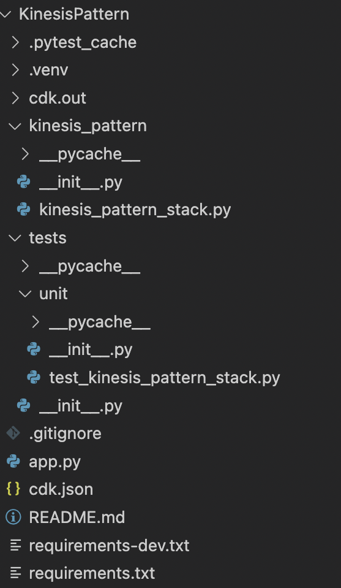

# Getting started with the Kinesis Data Firehose template guide 

## Setting up and prerequisites

### AWS Account 

If you don't already have an AWS account follow [Setup Your Environment](https://aws.amazon.com/getting-started/guides/setup-environment/) for a quick overview to get started.

### AWS CloudFormation 

Before you start using AWS CloudFormation, you might need to know what IAM permissions you need, how to start logging AWS CloudFormation API calls, or what endpoints to use. Refer to this [guide](https://docs.aws.amazon.com/AWSCloudFormation/latest/UserGuide/settingup.html) to get started using AWS CloudFormation.

### AWS  CDK

**Note**: If you are just going to use the sample demo template you can skip this section.

The AWS Cloud Development Kit (CDK) is an open-source software development framework that lets you define your cloud infrastructure as code in one of its supported programming languages. It is intended for moderately to highly experienced AWS users. Refer to this [guide](https://aws.amazon.com/getting-started/guides/setup-cdk/?pg=gs&sec=gtkaws) to get started with AWS CDK.

## Template deployment and CloudFormation stack creation

___

A template is a JSON or YAML text file that contains the configuration information about the AWS resources you want to create in the [stack](https://docs.aws.amazon.com/cdk/v2/guide/stacks.html). To learn more about how to work with CloudFormation templates refer to the [Working with templates](https://docs.aws.amazon.com/AWSCloudFormation/latest/UserGuide/template-guide.html) guide. 

You can either use the provided demo template and deploy it directly in the console or customize the template’s resources before deployment using AWS CDK. Based on your decision follow the respective section below. 

### Sample demo template 

By using the sample JSON template that is provided, you do not need to take any further actions except creating the stack by uploading the template file. For simplicity’s sake, a simple code is provided that you can run on your device. It is an example of multiple devices sending their weather measurements to the cloud through ExpressLink. You can find the code and guide to get it working under the `demo/demo_weather_station_code` directory.

Follow the steps below to create the CloudFormation stack using the sample template file. 

1. Sign in to the AWS Management Console and open [AWS CloudFormation console.](https://console.aws.amazon.com/cloudformation)
2. If this is a new CloudFormation account, select **Create New Stack**. Otherwise, choose **Create Stack** and then select **with new resources**.
3. In the **Template** section, select **Upload a template file** and upload the JSON template file. Choose **Next**.
4. In the **Specify Details** section, enter a stack name in the **Name** field.
5. If you want you can add tags to your stack. Otherwise, select **Next**.
6. Review the stack’s settings and then select **Create.**
7. At this point, you will find the status of your stack to be `CREATE_IN_PROGRESS`. Your stack might take several minutes to get created. See the next sections to learn about monitoring your stack creation.

### Custom template

If you are interested in using the CloudFormation templates more than just for demo purposes, you need to customize the stack’s resources based on your specific use case. Follow the steps below to do so:

1. Make sure that you already [set up your AWS CDK](https://aws.amazon.com/getting-started/guides/setup-cdk/?pg=gs&sec=gtkaws) environment.
2. Starting in your current directory, change your directory and go to `aws_cdk/KinesisPattern` directory.
3. Just to verify everything is working correctly, list the stacks in your app by running `cdk ls`. If you don't see `KinesisPatternStack`, make sure you are currently in the `KinesisPattern` directory.
4. The structure of the files inside `KinesisPattern` is as below: 

* `kinesis_pattern_stack.py`  is the main code of the stack. It is here where the required resources are created. 
* `tests/unit/test_kinesis_pattern_stack.py` is where the unit tests of the stack are written. The unit tests check
    * Right creation of the resources in addition to their properties
    * Dependencies between the resources 
    * Right error handlings in case of input violations
* `cdk.json` tells the CDK Toolkit how to execute your app. Context values are key-value pairs that can be associated with an app, stack, or construct. You can add the context key-values to this file or in the command line before synthesizing the template.
* `README.md` is where you can find detailed instructions on how to get started with the code including how to synthesize the template, a set of useful commands, the stack’s context parameters, and details about the code.
* `cdk.out` is where the synthesized template (in a JSON format) will be located in.

1. Run `source .venv/bin/activate` to activate the app's Python virtual environment.
2. Run `python -m pip install -r requirements.txt` and `python -m pip install -r requirements.txt` to install the dependencies.
3. Go through the `README.md` file to learn about the context parameters that need to be set by you prior to deployment.
4. Set the context parameter values either by changing `cdk.json` file or by using the command line.
    1. To create a command line context variable, use the **`—-context (-c) option`**, as shown in the following example: `$ cdk synth -c bucket_name=mybucket`
    2. To specify the same context variable and value in the `cdk.json` file, use the following code.`
          {"context": { "bucket_name": "mybucket"}`
5. Run `cdk synth` to emit the synthesized CloudFormation template.
6. Run `python -m pytest` to run the unit tests. It is the best practice to run the tests before deploying your template to the cloud.
7. Run `cdk deploy` to deploy the stack to your default AWS account/region.
8. Use the instructions in the ***Stack management*** section below to manage your stack creation. 

## Stack management

___

### Viewing CloudFormation stack data and resources

After deployment, you may need to monitor your created stack and its resources. To do this, your starting point should be AWS CloudFormation.  

1. Sign in to the AWS Management Console and open [AWS CloudFormation console](https://console.aws.amazon.com/cloudformation).
2. Select the **Stacks** tab to view all the available stacks in your account. 
3. Find the stack that you just created and click on it. 
4. To verify that the stack’s creation is done successfully, check if its status is `CREATE_COMPLETE`. To learn more about what each status means refer to [Stack status codes](https://docs.aws.amazon.com/AWSCloudFormation/latest/UserGuide/cfn-console-view-stack-data-resources.html#cfn-console-view-stack-data-resources-status-codes). 
5. You can view the stack information such as its ID, status, policy, rollback configuration, etc under the **Stack info** tab.  
6. If you click on the **Events** tab, each major step in the creation of the stack sorted by the time of each event, with the latest events on top is displayed. 
7. You can also find the resources that are part of the stack under the **Resources** tab. 

There is more information about viewing stack information [here](https://docs.aws.amazon.com/AWSCloudFormation/latest/UserGuide/cfn-console-view-stack-data-resources.html#cfn-console-view-stack-data-resources-view-info).

###  Monitoring the generated resources

If you deploy and create the stack successfully, the following resources must get created under your stack. You can verify their creation by checking the **Resources** tab in your stack as mentioned above. 

|Resourse	|Type	|
|---	|---	|
|CDKMetadata	|[AWS::CDK::Metadata](https://docs.aws.amazon.com/cdk/api/v1/docs/constructs.ConstructMetadata.html)	|
|Kinesis Delivery Stream	|[AWS::KinesisFirehose::DeliveryStream](https://docs.aws.amazon.com/AWSCloudFormation/latest/UserGuide/aws-resource-kinesisfirehose-deliverystream.html)	|
|Delivery stream's destination bucket (and its bucketPolicy and deleteObjects)	|[AWS::S3::Bucket](https://docs.aws.amazon.com/AWSCloudFormation/latest/UserGuide/aws-properties-s3-bucket.html) [AWS::S3::BucketPolicy](https://docs.aws.amazon.com/AWSCloudFormation/latest/UserGuide/aws-properties-s3-policy.html)	|
|IAM role and policy to grant Firehose access to S3	|[AWS::IAM::Role](https://docs.aws.amazon.com/AWSCloudFormation/latest/UserGuide/aws-resource-iam-role.html) [AWS::IAM::Policy](https://docs.aws.amazon.com/AWSCloudFormation/latest/UserGuide/aws-resource-iam-policy.html)	|
|CloudWatch log group and log stream to capture error logs (delivery stream to bucket action)	|[AWS::Logs::LogGroup](https://docs.aws.amazon.com/AWSCloudFormation/latest/UserGuide/aws-resource-logs-loggroup.html)	|
|IoT Rule	|[AWS::IoT::TopicRule](https://docs.aws.amazon.com/AWSCloudFormation/latest/UserGuide/aws-resource-iot-topicrule.html)	|
|CloudWatch log group to capture error logs (IoT Core to Kinesis action)	|[AWS::Logs::LogGroup](https://docs.aws.amazon.com/AWSCloudFormation/latest/UserGuide/aws-resource-logs-loggroup.html)	|
|IAM role and policy that grants IoT access to Kinesis firehose	|[AWS::IAM::Role](https://docs.aws.amazon.com/AWSCloudFormation/latest/UserGuide/aws-resource-iam-role.html) [AWS::IAM::Policy](https://docs.aws.amazon.com/AWSCloudFormation/latest/UserGuide/aws-resource-iam-policy.html)	|
|IAM role and policy that grants IoT access to the CloudWatch log groups	|[AWS::IAM::Role](https://docs.aws.amazon.com/AWSCloudFormation/latest/UserGuide/aws-resource-iam-role.html) [AWS::IAM::Policy](https://docs.aws.amazon.com/AWSCloudFormation/latest/UserGuide/aws-resource-iam-policy.html)	|
|Glue database	|[AWS::Glue::Database](https://docs.aws.amazon.com/AWSCloudFormation/latest/UserGuide/aws-resource-glue-database.html)	|
|Gue crawler	|[AWS::Glue::Crawler](https://docs.aws.amazon.com/AWSCloudFormation/latest/UserGuide/aws-resource-glue-crawler.html)	|
|IAM role and policy that grants Glue access to S3	|[AWS::IAM::Role](https://docs.aws.amazon.com/AWSCloudFormation/latest/UserGuide/aws-resource-iam-role.html)[AWS::IAM::Policy](https://docs.aws.amazon.com/AWSCloudFormation/latest/UserGuide/aws-resource-iam-policy.html)	|

### Handling stack failures

If CloudFormation fails to create, update, or delete your stack, you will be able to go through the logs or error messages to learn more about the issue. There are some general methods for troubleshooting a CloudFormation issue. For example, you can follow the steps below to find the issue manually in the console. 

* Check the status of your stack in the [CloudFormation console](https://console.aws.amazon.com/cloudformation/). 
* From the **Events** tab, you can see a set of events while the last operation was being done on your stack.
* Find the failure event from the set of events and then check the status reason of that event. The status reason usually gives a good understanding of the issue that caused the failure.

In case of failures in stack creations or updates, CloudFormation automatically performs a rollback. However, you can also [add rollback triggers during stack creation or updating](https://docs.aws.amazon.com/AWSCloudFormation/latest/UserGuide/using-cfn-rollback-triggers.html#using-cfn-rollback-triggers-create) to further monitor the state of your application. By setting up the rollback triggers if the application breaches the threshold of the alarms you've specified, it will roll back to that operation. 

Finally, this [troubleshooting guide](https://docs.aws.amazon.com/AWSCloudFormation/latest/UserGuide/troubleshooting.html#basic-ts-guide) is a helpful resource to refer if there is an issue in your stack. 

### Estimating the cost of the stack

There is no additional charge for AWS CloudFormation. You pay for AWS resources created using CloudFormation as if you created them by hand. Refer to this [guide](https://docs.aws.amazon.com/AWSCloudFormation/latest/UserGuide/using-cfn-paying.html) to learn more about the stack cost estimation functionality.

## Ingesting and visualizing your IoT data with the constructed resources

___

### Sending data to the cloud from your device

Now that your stack and all the required resources are created and available, you can start by connecting your device to the cloud and sending your data to the cloud. 

* If you are new to AWS IoT Core, this [guide](https://docs.aws.amazon.com/iot/latest/developerguide/connect-to-iot.html) is a great starting point to connect your device to the cloud. 
* After connecting your device to IoT Core, you can use the [MQTT test client](https://docs.aws.amazon.com/iot/latest/developerguide/view-mqtt-messages.html) to monitor the MQTT messages being passed in your AWS account. 
* Move to the **Rules** tab under the **Message Routing** section in the [AWS IoT console](https://console.aws.amazon.com/iot/home). There you can verify the creation of the newly created topic rule and its [firehose rule action](https://docs.aws.amazon.com/iot/latest/developerguide/kinesis-firehose-rule-action.html) which sends your data from MQTT messages to the Amazon Kinesis Data Firehose stream.

### Access and query the data sent to the Kinesis delivery stream

* Open [Amazon Kinesis console](https://console.aws.amazon.com/kinesis).
* From the left navigation pane, choose **Delivery streams.**
* Find the delivery stream that was created by your stack and select it.
* Select the **Configuration** tab.
* In the **Destination settings** section, you would be able to find the detention s3 bucket url. Click on it. 
* You are now able to see your data in the form of nested folders in the bucket (partitioned data). You can download the files or continue with the rest of the steps to query them using AWS glue and Amazon Athena. (Refer to [Athena integration with AWS Glue](https://docs.aws.amazon.com/athena/latest/ug/glue-athena.html) for more detailed instructions)
    * If you cannot see any data in your bucket, follow these steps:
        * Simply wait for a couple of minutes. this is because Kinesis Data Firehose buffers incoming data before delivering it to the S3 destination. Therefore, it might be the buffer size or interval that is not full yet to write the data to your bucket. If after a couple of minutes, you still cannot see any data in your bucket then move to the next step.
        * Go back to the [Amazon Kinesis console](https://console.aws.amazon.com/kinesis) and find your delivery stream. Under the **Test with demo data** section, click on **Start sending demo data**. This enables you to test the configuration of your delivery stream regardless of your own data availability. Check your bucket again to see if any data is being received there. If there is not, there is an issue with sending data from the delivery stream to S3. Click on the **Destination error logs** tab and open the CloudWatch log group.  Select the log stream there and go through the event logs to find the issue. [Troubleshooting Kinesis Data Firehose](https://docs.aws.amazon.com/firehose/latest/dev/troubleshooting.html) is a helpful resource to help you find out the cause of the problem.
        * If the test data from the previous part was successfully landed in the destination bucket, it means that the issue is with your device data being sent to the Kinesis delivery stream. To fix it first make sure that your device is connected to the cloud and is sending data by using the [MQTT test client](https://docs.aws.amazon.com/iot/latest/developerguide/view-mqtt-messages.html). More details about this are provided in the previous section.
        * If your data is getting landed in IoT Core but not in the delivery stream, there might be an error happening while the IoT rule attempts to send data from IoT Core to Kinesis Data Firehose. To find out about the issue, you can use the CloudWatch log group that is created by the template earlier. To do so, open the [Cloudwatch console](https://console.aws.amazon.com/cloudwatch). From the navigation bar, select **Log > Log Groups**. Find the log group that was created for logging the IoT rules’ errors and select it. View the logs to find out the issue. 
* During the CloudFormation stack deployment, a Glue crawler was created that retrieves the bucket’s data automatically and outputs the results to the Athena database and table that was created by the stack. To access this Glue crawler, open [AWS Glue console](https://console.aws.amazon.com/glue). From the navigation pane, select **Crawlers.** Find the crawler that was created earlier and select it. 
* Select **Run Crawler**. 
* You can see that the status of the crawler changes to **Starting**. Wait for the crawler to finish its run (i.e. its state goes back to **Ready**)
* If the run is successful, under the **Tables added** column you should see **1** which means the crawler created a glue table. (Note that if this is not your first time running the crawler, the **Tables updated** column would change)
    * If there is no table added or updated, click on the **Logs** of the crawler. It navigates you to the CloudWatch log group that captures the error logs of the crawler. From there you can find the error message. [Troubleshooting AWS Glue](https://docs.aws.amazon.com/glue/latest/dg/troubleshooting-glue.html)can be a helpful guide to fix the issue. 
* Open [Athena console](https://console.aws.amazon.com/athena/home).
* In the query editor, choose the glue database that was created earlier. (The data source should be **AWSDataCatalog** by default) 
* Under the database, you can find the newly added glue table. 
* Query the table using the editor. Now you can see your device’s data in a table format. 

### Optional steps 

* You can transform source records with AWS Lambda or convert record format. 
    * Open [Amazon Kinesis console](https://console.aws.amazon.com/kinesis) and from the left navigation pane, choose **Delivery streams. f**ind the delivery stream that was created by your stack and select it.
    * Select the **Configuration** tab.
    * Edit the **Transform and convert records** section with the settings you want to use in your application. Refer to [Record Transformation and Record Format Conversion](https://docs.aws.amazon.com/firehose/latest/dev/create-transform.html) for more information. 
* Kinesis Data Firehose buffers incoming records before delivering them to your S3 bucket. Record delivery is triggered once the value of either of the specified buffering hints is reached. You can change the Kinesis buffer size or interval based on your specific use case. Additionally, you can edit the record compression and encryption settings. 
    * Open [Amazon Kinesis console](https://console.aws.amazon.com/kinesis) and from the left navigation pane, choose **Delivery streams**. Find the delivery stream that was created by your stack and select it.
    * Select the **Configuration** tab.
    * Edit **Buffer hints** and **Compression and encryption** under the **Destination settings** section. Refer to [Destination Settings](https://docs.aws.amazon.com/firehose/latest/dev/create-destination.html) for more information. 
* You can change the run frequency of the Glue crawler based on your use case. By default, it is on **Run on demand** mode therefore, every time you want to update your glue database/table with new data you should manually run the crawler. You can schedule the crawler’s runs by: 
    * Open [AWS Glue console](https://console.aws.amazon.com/glue). From the navigation pane, select **Crawlers.** Find the demo crawler and select it. 
    * Select **Edit**.
    * Under the **Schedule** section, select your desired frequency from the drop-down and save.

### Integrating with dashboards to visualize data

In the previous section, you were able to see your device’s data in a glue table format using a crawler and Athena editor. You can take a further step to visualize your data and create dashboards. Here are two possible integrations with reporting dashboards :

#### Amazon QuickSight

Amazon Athena provides direct integration with [Amazon QuickSight](https://aws.amazon.com/quicksight/). Amazon QuickSight is a fast business analytics service you can use to build visualizations, perform ad-hoc analysis, and quickly get business insights from your data. Amazon QuickSight is available in [these regions](https://docs.aws.amazon.com/general/latest/gr/quicksight.html).

To connect Athena to QuickSight you need to follow these steps: 

1. Navigate to the AWS QuickSight console.
2. If you have never used AWS QuickSight before, you will be asked to sign up. In this case, choose the **Standard** tier and your region as your setup.
3. During the signup phase, give QuickSight access to your Amazon S3 buckets and Amazon Athena.
4. If you already have an account, give Amazon QuickSight access to your Athena by choosing **Admin >** **Manage QuickSight > Security & permissions.** Under QuickSight access to AWS services, choose **Add or remove**, then select the check box next to Amazon Athena and the Amazon S3 (select the buckets that are required) and choose **Update**.
5. From the admin Amazon QuickSight console page choose **New Analysis** and **New data set.**
6. Choose Athena as the source and enter a name for your data source. Let the Athena workgroup be ***[ primary ]* **and proceed.
7. Choose your Glue database and table to import.
8. After your data source is created, you can start making visualizations in Amazon QuickSight.

#### Amazon Managed Grafana

With Amazon Managed Grafana, you can add Athena as a data source by using the AWS data source configuration option in the Grafana workspace console. To get started refer to [Setting up](https://docs.aws.amazon.com/grafana/latest/userguide/Amazon-Managed-Grafana-setting-up.html) to set up your amazon Managed Grafana and then follow this [guide](https://docs.aws.amazon.com/grafana/latest/userguide/AWS-Athena.html) to connect Athena to your Amazon Managed Grafana. Note that there are prerequisites for Athena to be accessible to the Amazon Managed Grafana, make sure to follow these steps.

## Cleaning up the stack

___

To clean up all the resources used in this demo, all you need to do is to delete the initial CloudFormation stack. To delete a stack and its resources, follow these steps:

1. Open [AWS CloudFormation console](https://console.aws.amazon.com/cloudformation/).
2. On the Stacks page in the CloudFormation console, select the stack that you want to delete. Note that the stack must be currently running.
3. In the stack details pane, choose **Delete**.
4. Confirm deleting stack when prompted. 

After the stack is deleted, the stack’s status will be `DELETE_COMPLETE`. Stacks in the `DELETE_COMPLETE` state aren't displayed in the CloudFormation console by default. However, you can follow the instructions in [Viewing deleted stacks on the AWS CloudFormation console](https://docs.aws.amazon.com/AWSCloudFormation/latest/UserGuide/cfn-console-view-deleted-stacks.html) to be able to view them. 

Finally, if the stack deletion failed, the stack will be in the `DELETE_FAILED` state. For solutions, see [Delete stack fails](https://docs.aws.amazon.com/AWSCloudFormation/latest/UserGuide/troubleshooting.html#troubleshooting-errors-delete-stack-fails) troubleshooting topic. In this case, make sure to refer to the **Monitoring the generated resources** section of this document to verify that all the resources got deleted successfully. 

## Useful resources 

___

* [CloudFormation User Guide](https://docs.aws.amazon.com/AWSCloudFormation/latest/UserGuide/index.html)
* [Kinesis Data Firehose User Guide](https://docs.aws.amazon.com/firehose/latest/dev/what-is-this-service.html)
* [IoT Core User Guide](https://docs.aws.amazon.com/iot/latest/developerguide/index.html)
* [AWS Glue User Guide](https://docs.aws.amazon.com/glue/latest/dg/what-is-glue.html)
* [Amazon Athena User Guide](https://docs.aws.amazon.com/athena/latest/ug/what-is.html)
* [AWS CDK (v2) User Guide](https://docs.aws.amazon.com/cdk/v2/guide/index.html)
* [Amazon Managed Grafana User Guide](https://docs.aws.amazon.com/grafana/latest/userguide/index.html)
