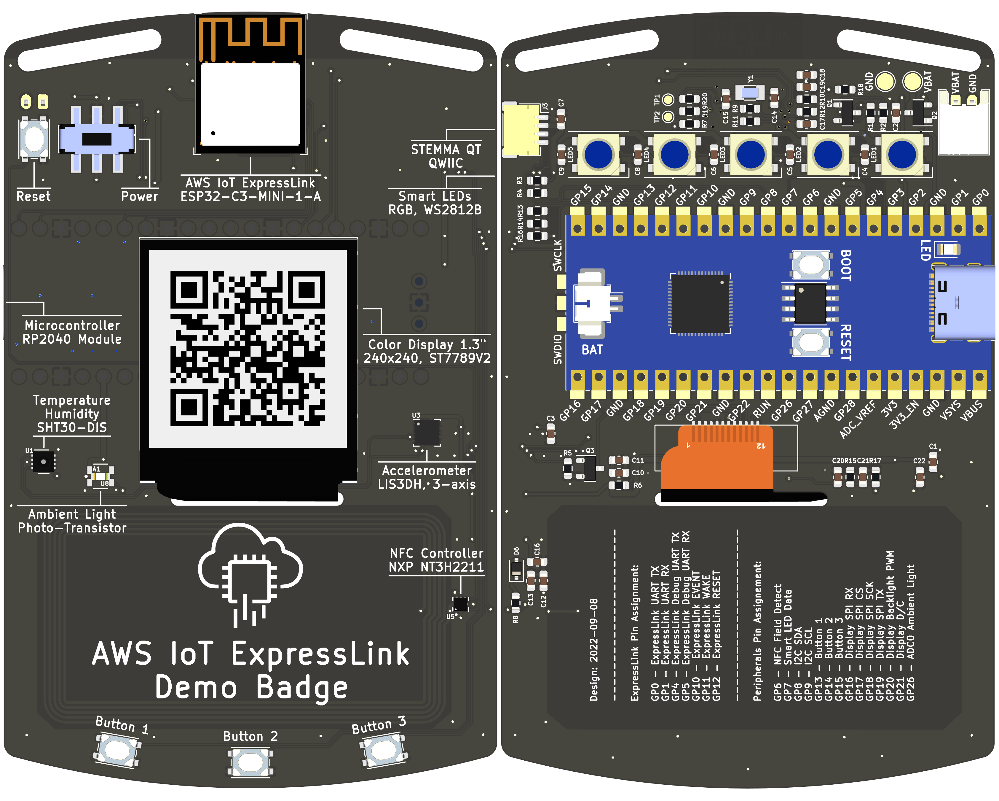

# AWS IoT ExpressLink Demo Badge

This device was designed and created for the [AWS IoT ExpressLink Demo Badge Workshop](https://catalog.workshops.aws/aws-iot-expresslink-demo-badge/), which was run at re:Invent 2022.

The Demo Badge features an RP2040 microcontroller, an Espressif ESP32-C3-MINI-1-A AWS IoT ExpressLink module, various sensors, buttons, RGB LEDs, and a color display.

You can find more information about the device itself, and its components, as part of the [workshop appendix](https://catalog.workshops.aws/aws-iot-expresslink-demo-badge/en-US/7-appendix).



## Schematic

The schematic for the Demo Badge is available as KiCAD 6 project. You can access a [PDF version of the single-sheet schematic here](./snapshot/Schematic/aws-iot-expresslink-demo-badge-schematic.pdf).

## PCB Layout

The PCB layout for the Demo Badge is available as KiCAD 6 project, including all footprints (publicly available ones, and custom ones).

You can access the [production Gerber files here](./snapshot/Manufacturers/JLCPCB/).

## Re-generate Gerbers and other files

If you made any changes to the PCB layout, you have to re-generate the Gerbers files before sending them to your PCB manufacturer. You can use [KiBot](https://github.com/INTI-CMNB/KiBot) to generate Gerbers and other files in a repeatable way using the `kibot.yaml` configuration file.

You can follow the KiBot installation guide, or use a Docker container:

```bash
docker run --rm -v "$PWD":/kicad -w /kicad setsoft/kicad_auto:ki6 kibot -c kibot.yaml
```

All KiBot-generated files are available under `Generated/`.

## License

This hardware design is licensed under the MIT-0 License. Imported footprints and 3D models might contain different licenses.
